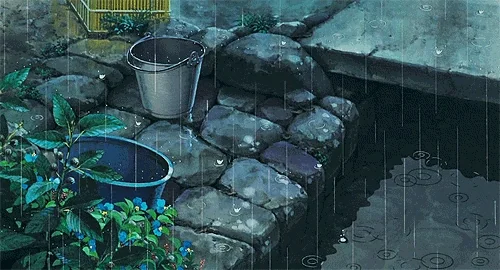

# Konichiwa 👋

 
 

# About ME 💬 :

### - I'm 15 years old Front-end Junior developer from Ukraine.

### - Learning :

- ✨ React
- ✨ SCSS
- ✨ JS

### - Hobbies :

- ✨ Story games
- ✨ Watch anime
- ✨ Reading books

 
 
 

# Languages & Tools 👨‍💻 🛠:

 
 

 

# Contact Me :

   

If you want to reach out to me about anything, just to talk or want to game together just ping me 😉.

</a>

 

 

 

 
 
 
 
 
 
 
 
 
 
 

  

  
  

---
